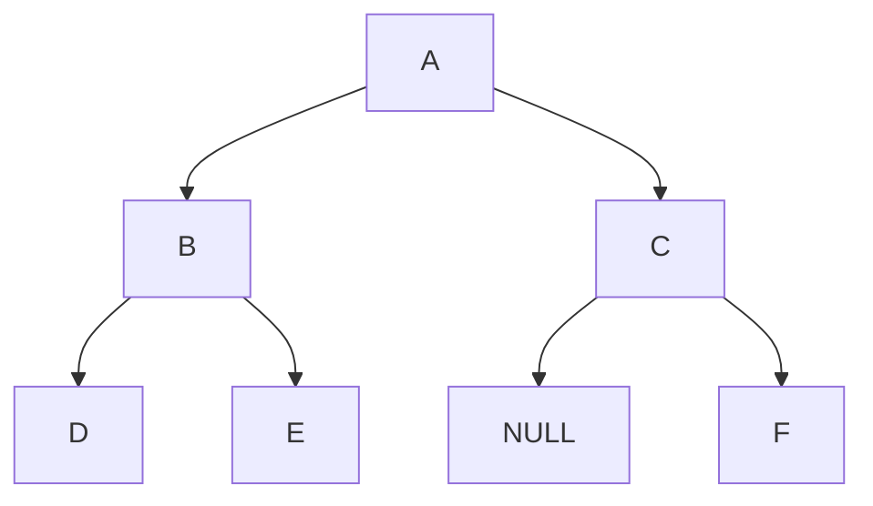

# 二叉树遍历以及创建

现有如下二叉树


[TOC]

## 二叉树的遍历

### 先序遍历

首先访问根节点，再遍历左子树，最后遍历右子树。 

先序遍历结果：ABDECF
* 递归

```java
public List<Integer> preorderTraversal(TreeNode root) {
        rs = new ArrayList<>();
        pTBacktrack(root);
        return rs;
    }
```
```java
private void pTBacktrack(TreeNode root) {
        if (root == null)
            return;
        rs.add(root.val);
        pTBacktrack(root.left);
        pTBacktrack(root.right);
    }
```
* 迭代
> 使用辅助栈暂存根节点
```java
public List<Integer> preorderTraversal2(TreeNode root) {
        rs = new ArrayList<>();
        TreeNode cur = root;
        Deque<TreeNode> stk = new LinkedList<>();
        while (cur != null || !stk.isEmpty()) {
            if (cur != null) {
                rs.add(cur.val);
                stk.push(cur);
                cur = cur.left;
            } else {
                cur = stk.pop();
                cur = cur.right;
            }
        }
        return rs;
    }
```

### 中序遍历
首先遍历左子树，再访问根节点，最后遍历右子树。

中序遍历结果：DBEAFC
* 递归

```java
public List<Integer> inorderTraversal(TreeNode root) {
        rs = new ArrayList<>();
        iTBacktrack(root);
        return rs;
    }
```
```java
private void iTBacktrack(TreeNode root) {
        if (root == null) 
            return;
        iTBacktrack(root.left);
        rs.add(root.val);
        iTBacktrack(root.right);
    }
```
* 迭代

```java
public List<Integer> inorderTraversal2(TreeNode root) {
        TreeNode cur = root;
        rs = new ArrayList<>();
        Deque<TreeNode> stk = new LinkedList<>();
        while (cur != null || !stk.isEmpty()) {
            if (cur != null) {//遍历左子树
                stk.push(cur);//将根节点入栈
                cur = cur.left;
            } else {
                cur = stk.pop();
                rs.add(cur.val);//访问根节点
                cur = cur.right;//遍历右子树
            }
        } 
        return rs;
    }
```

### 后序遍历
首先遍历左子树，再遍历右子树，最后访问根节点。

后序遍历结果：DEBFCA
* 递归

```java
public List<Integer> postorderTraversal(TreeNode root) {
        rs = new ArrayList<>();
        postTBacktrack(root);
        return rs;
    }
```
```java
private void postTBacktrack(TreeNode root) {
        if (root == null)
            return;
        postTBacktrack(root.left);
        postTBacktrack(root.right);
        rs.add(root.val);
    } 
```
* 迭代

```java
public List<Integer> postorderTraversal2(TreeNode root) {
        rs = new ArrayList<>();
        TreeNode cur = root;
        Deque<TreeNode> stk = new LinkedList<>();
        stk.push(root);
        while (!stk.isEmpty()) {
            TreeNode tn = stk.peek();
            if (tn.left != null && tn.left != cur && tn.right != cur) {
                stk.push(tn.left);
            } else if (tn.right != null && tn.right != cur) {
                stk.push(tn.right);
            } else {
                cur = stk.pop();
                rs.add(cur.val);
            }
        }
        return rs;
    }
```

### 层次遍历
按照二叉树层进行遍历

层次遍历结果：ABCDE NULL F

* 迭代
>1.使用队列暂存上一层的节点;2.遍历队列中节点的左右子节点，若不为空则入队，并将该节点出队。
```java
public List<List<Integer>> levelorderTraversal(TreeNode root) {
        List<List<Integer>> res = new ArrayList<>();
        if (root == null) return res;
        Deque<TreeNode> que = new LinkedList<>();
        que.add(root);
        while (!que.isEmpty()) {
            int cnt = que.size();//这一层节点个数
            while (cnt > 0) {
                TreeNode tmp = que.peek();
                res.add(tmp.val);//这一层节点值组成的数组
                //非空子节点入队
                if (tmp.left != null) {
                    que.add(tmp.left);
                }
                if (tmp.right != null) {
                    que.add(tmp.right);
                }
                que.poll();//该节点出队
                cnt--;                
            }
        }
        return res;
    }
```

---

## 使用数组创建二叉树

### 使用层次遍历创建二叉树

在LeetCode中二叉树部分，编写测试用例时，需要将数组按照层次遍历建立一个二叉树，大概思想如下：

1.建立队列que用来存储上一层中不是null的节点

2.本层的节点个数应该为que.size() << 1

3.遍历本层中的节点，每两个节点的父节点相同，将已经赋过子节点的父节点出队列，将本层中为null的节点入队列

其代码实现如下

```java
public static TreeNode creatBinaryTree(Integer[] array) {
        if (array.length == 0 || array[0] == null)
            return null;
        TreeNode[] treeArray = new TreeNode[array.length];
        treeArray[0] = new TreeNode(array[0]);
        int idx = 1;// 数组元素下标
        Queue<Integer> notNullNode = new LinkedList<>();// 存储不为null的节点的下标
        notNullNode.add(0);
        while (idx < array.length) {
            int len = idx + notNullNode.size() * 2 < array.length ? notNullNode.size() * 2 : array.length - idx;
            for (int i = 0; i < len; i++, idx++) {
                if (array[idx] == null) {
                    treeArray[idx] = null;
                } else {
                    treeArray[idx] = new TreeNode(Integer.valueOf(array[idx]));
                    notNullNode.add(idx);//入队列
                }
                if (i % 2 == 0) {
                    treeArray[notNullNode.peek()].left = treeArray[idx];
                } else {//出队列
                    treeArray[notNullNode.poll()].right = treeArray[idx];
                }
            }
        }
        return treeArray[0];
    }
```

